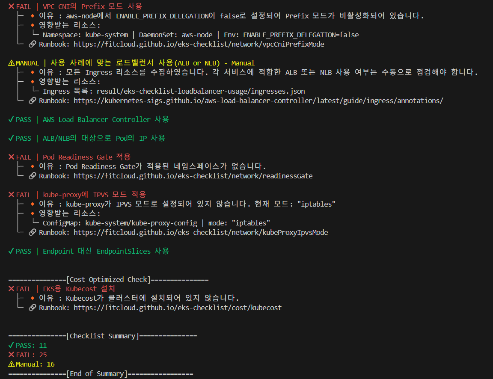

[![GitHub Release][release-img]][release]
[![Downloads][download-img]][release]
[![Language][go-img]][go-link]
[![Cloud Platform][aws-img]][aws-link]
[![Best Practice][eks-best-img]][eks-best-link]
[![Best Practice][k8s-best-img]][k8s-best-link]
[![Runbook][runbook-img]][runbook-link]
[![Service][eks-img]][eks-link]

<!-- Badge Definitions -->
[release-img]: https://img.shields.io/github/v/release/fitcloud/eks-checklist?logo=github
[download-img]: https://img.shields.io/github/downloads/fitcloud/eks-checklist/total.svg
[go-img]: https://img.shields.io/badge/Language-Go-blue?logo=go
[aws-img]: https://img.shields.io/badge/Cloud_Platform-AWS-FF9900?logo=amazon-aws&logoColor=white
[eks-img]: https://img.shields.io/badge/Service-Elastic%20Kubernetes%20Service-FF9900?logo=amazon-eks&logoColor=white
[eks-best-img]: https://img.shields.io/badge/AWS_EKS-Best_Practice-FF9900?logo=amazon-eks&logoColor=white
[k8s-best-img]: https://img.shields.io/badge/Kubernetes-Best_Practice-326CE5?logo=kubernetes&logoColor=white
[runbook-img]: https://img.shields.io/badge/Runbook-Guide-2f7b6f?logo=read-the-docs&logoColor=white

<!-- Links -->
[release]: https://github.com/fitcloud/eks-checklist/releases
[go-link]: https://go.dev/
[aws-link]: https://aws.amazon.com/
[eks-link]: https://aws.amazon.com/eks/
[eks-best-link]: https://docs.aws.amazon.com/ko_kr/eks/latest/best-practices
[k8s-best-link]: https://kubernetes.io/docs/setup/best-practices/
[runbook-link]: https://fitcloud.github.io/eks-checklist/


# EKS-Checklist
EKS-Checklist는 Amazon EKS (Elastic Kubernetes Service) 클러스터의 설정 및 상태를 점검하는 도구입니다. 이 도구는 Go 언어로 개발되었으며, AWS-SDK-Go와 Go-K8s 및 Cobra을 활용하여 클러스터에 대한 정보를 가져와 EKS 클러스터의 **비용 최적화(Cost)**, **일반 설정(General)**, **네트워크(Network)**, **확장성(Scalability)**, **보안(Security)**, **안정성(Reliability)** 등을 개선할 수 있습니다.
이 도구는 EKS 클러스터가 AWS EKS 권장 모범 사례 및 Kubernetes의 권장 모범 사례를 준수하고 있는지 점검하고, 클러스터 운영을 최적화하는 데 필요한 권장 사항을 제공합니다.



## 프로젝트 목적 / 배경
Amazon EKS는 관리형 Kubernetes 서비스이지만, 클러스터를 직접 운영하다 보면 다양한 설정 실수나 비효율이 발생하기 쉽습니다. 비용,권한 설정,네트워크 구성, 확장성 부족 등의 문제는 운영 안정성과 보안에 큰 영향을 미칠 수 있습니다.
**EKS-Checklist**는 이러한 문제를 점검하고 개선을 할 수 있도록 개발된 도구입니다. AWS 및 Kubernetes의 권장 모범 사례(Best Practices)를 기반으로 클러스터를 자동으로 분석하여 운영자가 **효율적인 클러스터 환경을 유지**할 수 있도록 개발되었습니다.

## 점검 항목
- **비용 최적화 (Cost)**: EKS 클러스터의 리소스 사용을 점검하여 불필요한 비용을 줄일 수 있는 방법을 제공합니다.
- **일반 설정 (General)**: 클러스터의 기본 설정과 환경이 적절하게 구성되었는지 확인합니다.
- **네트워크 (Network)**: VPC, 서브넷, 보안 그룹 등 네트워크 구성을 점검하여 네트워크가 올바르게 설정되었는지 확인합니다.
- **확장성 (Scalability)**: 클러스터가 필요에 따라 확장 가능하도록 설정되었는지 점검합니다.
- **보안 (Security)**: IAM 정책, 인증 및 권한 설정 등 보안 설정을 점검하여 클러스터가 안전하게 운영되고 있는지 확인합니다.
- **안정성 (Reliability)**: 클러스터의 안정성을 위한 백업, 모니터링 및 로깅 설정이 제대로 되어 있는지 점검합니다.

## 필수 조건
EKS-Checklist를 사용하기 전에 다음 항목들이 설치되고 올바르게 설정되어 있어야 합니다.
1. **AWS CLI**: AWS CLI가 설치되어 있고 적절한 권한으로 설정되어 있어야 합니다. 설치 및 설정 방법은 [여기](https://docs.aws.amazon.com/cli/latest/userguide/getting-started-install.html)를 참고하세요.
2. **AWS EKS 클러스터 접근 권한**: EKS-Checklist는 AWS EKS 클러스터에 접근할 수 있는 권한을 필요로 합니다.

## 설치 방법
EKS-Checklist는 GitHub의 릴리즈 페이지에서 원하는 버전을 다운로드하여 사용할 수 있습니다.
### GitHub Releases에서 다운로드
1. [GitHub Releases](https://github.com/fitcloud/eks-checklist/releases) 페이지로 이동합니다.
2. 원하는 버전의 태그를 선택합니다.
3. 운영 체제에 맞는 바이너리를 다운로드합니다.

## 사용법
### 실행 flags
```bash
{바이너리 파일명} {--flags}
예: eks-checklist-darwin-amd64 --help
```
- `--context` : 사용할 kubeconfig 컨텍스트 이름
- `--kubeconfig` : 사용할 kubeconfig 파일 경로 (기본값: `"C:\\Users\\사용자이름\\.kube\\config"`)
- `--filter` : 출력 결과 필터링 옵션 (`all`, `pass`, `fail`, `manual`)
- `--output` : 출력 형식 지정 (`text`, `html`) — 기본값: `text`
- `--profile` : 사용할 AWS CLI 프로파일 이름
- `--sort` : 결과를 상태별(PASS / FAIL / MANUAL)로 정렬
- `-h`, `--help` : 도움말 출력
### macOS (Darwin)
1. [Releases 페이지](https://github.com/fitcloud/eks-checklist/releases)에서 macOS용 바이너리를 다운로드
   예: `eks-checklist-darwin-amd64`
2. 실행 권한 부여 및 설치:
```bash
chmod +x eks-checklist-darwin-amd64
sudo mv eks-checklist-darwin-amd64 /usr/local/bin/eks-checklist
```
3. 실행 예시:
```bash
eks-checklist-darwin-amd64 --profile {AWS_Profile}
```
### Linux
1. [Releases 페이지](https://github.com/fitcloud/eks-checklist/releases)에서 Linux용 바이너리 다운로드
   예: `eks-checklist-linux-amd64`
2. 실행 권한 부여 및 설치:
```bash
chmod +x eks-checklist-linux-amd64
sudo mv eks-checklist-linux-amd64 /usr/local/bin/eks-checklist
```
3. 실행 예시:
```bash
eks-checklist-linux-amd64 --profile {AWS_Profile}
```
### Windows
1. [Releases 페이지](https://github.com/fitcloud/eks-checklist/releases)에서 `.exe` 파일 다운로드
   예: `eks-checklist-windows-amd64.exe`
2. 적절한 폴더에 저장 (예: `C:\\Program Files\\EKS-Checklist\\`)
3. 명령 프롬프트 또는 PowerShell에서 실행:
```bash
eks-checklist.exe --profile {AWS_Profile}
```