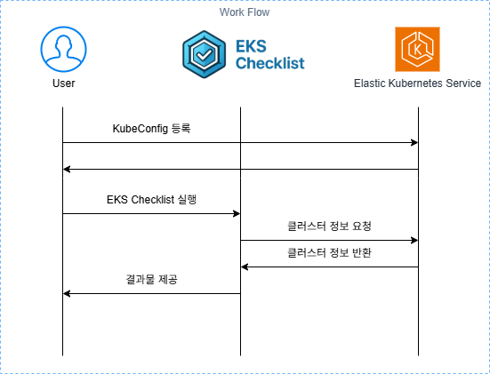

# How It Works

**EKS-Checklist**는 Amazon EKS (Elastic Kubernetes Service) 클러스터를 점검하는 도구입니다. 이 도구는 **Go** 언어로 개발되었으며, AWS SDK for Go, Kubernetes Go Client, 그리고 Cobra를 사용하여 클러스터의 상태를 자동으로 점검하고, 사용자에게 최적화, 보안 강화 및 비용 절감을 위한 인사이트를 제공합니다.



## 주요 기술 스택

- **Go**: Go 언어는 성능이 뛰어나고, 동시성(concurrency) 처리가 우수하여 대규모 클러스터를 점검하는 데 적합합니다.
- **AWS SDK for Go**: AWS 리소스와의 상호작용을 위해 사용됩니다. EKS 클러스터의 설정 및 상태 정보를 가져오고, 클러스터에 대한 API 호출을 관리합니다.
- **Kubernetes Go Client**: Kubernetes API와 직접 상호작용하여 클러스터의 상태를 가져오고 점검합니다.
- **Cobra**: CLI(Command Line Interface) 툴을 생성하는 데 사용됩니다. 사용자가 도구를 명령줄에서 쉽게 실행하고 옵션을 설정할 수 있도록 돕습니다.

## 작동 방식

### 1. **AWS SDK for Go를 통한 EKS 클러스터 정보 가져오기**

EKS 클러스터를 점검하려면 우선 **AWS SDK for Go**를 통해 EKS 클러스터에 대한 정보를 가져옵니다. 이를 통해 클러스터의 버전, 상태, 설정 등 기본 정보를 조회할 수 있습니다.

```go
type EksCluster struct {
	Cluster *types.Cluster
}

func Describe(clusterName string, cfg aws.Config) EksCluster {
	eksClient := eks.NewFromConfig(cfg)
	output, err := eksClient.DescribeCluster(context.TODO(), &eks.DescribeClusterInput{
		Name: &clusterName,
	})

	if err != nil {
		panic(err.Error())
	}

	eksCluster := EksCluster{Cluster: output.Cluster}

	return eksCluster
}
```

### 2. **Kubernetes Go Client를 사용한 클러스터 상태 점검**

Kubernetes Go Client를 사용하여 클러스터의 상태를 직접 점검합니다. EKS 클러스터에서 실행 중인 리소스 파드(pod), 노드(node), 서비스(service) 등의 상태를 가져오고, 이를 통해 클러스터의 성능 및 안정성을 진단합니다.

```go
config, err := rest.InClusterConfig()
if err != nil {
    log.Fatal("Failed to get in-cluster config: ", err)
}
clientset, err := kubernetes.NewForConfig(config)
if err != nil {
    log.Fatal("Failed to create Kubernetes client: ", err)
}
pods, err := clientset.CoreV1().Pods("").List(context.TODO(), metav1.ListOptions{})
if err != nil {
    log.Fatal("Failed to list pods: ", err)
}
```

### 3. **Cobra를 사용한 CLI 인터페이스 제공**

Cobra 라이브러리는 CLI 명령어를 생성하고, 사용자가 다양한 옵션을 통해 클러스터 점검을 실행할 수 있도록 돕습니다. 예를 들어, 클러스터 상태를 점검하려면 아래와 같은 명령어를 실행할 수 있습니다

```bash
eks-checklist --context my-cluster --profile dev --output text 
```
여기서 --context는 kubeconfig에서 사용할 클러스터 컨텍스트를 지정하고, --profile은 AWS CLI 프로파일을 설정합니다. --output 옵션을 통해 출력 형식을 text나 html로 설정할 수 있습니다다

### 4. **점검 항목 분석**

### **비용 최적화 (Cost)**

클러스터에서 리소스 사용 현황을 점검하고, 불필요한 자원을 식별하여 비용 절감 방안을 제시합니다. 미사용 리소스나 과도한 리소스 소비를 찾아내어 효율적인 비용 관리를 돕습니다.

### **일반 설정 (General)**

클러스터의 기본 설정을 점검하여 관리와 유지보수가 용이한지 확인합니다. 클러스터 버전, 리소스 태그, 메타데이터 등이 적절히 설정되어 있는지 점검하여 전반적인 클러스터 관리 효율성을 높입니다.

### **네트워크 (Network)**

클러스터의 네트워크 구성이 최적화되어 있는지 확인합니다. VPC, 서브넷, 보안 그룹 등 네트워크 요소를 점검하여 네트워크 성능과 보안성을 강화할 수 있는 방법을 제시합니다.

### **확장성 (Scalability)**

클러스터의 확장성 및 자동화 설정을 점검하여, 클러스터가 부하에 맞게 자동으로 확장되거나 축소될 수 있도록 합니다. 이를 통해 리소스를 효율적으로 관리하고, 트래픽 변화에 적응할 수 있습니다.

### **보안 (Security)**

클러스터의 보안 설정을 점검하여 잠재적인 보안 위협을 미리 예방합니다. IAM 정책, 인증, 권한 관리 등을 점검하여 클러스터에 대한 안전한 접근을 보장하고, 권한 관리를 강화합니다.

### **안정성 (Stability)**

클러스터의 안정성을 높이기 위해 모니터링, 로그, 백업 등을 점검합니다. 장애 발생 시 신속히 대응하고 복구할 수 있도록 설정을 점검하여 클러스터의 가용성과 신뢰성을 강화합니다.


### 5. **결과 출력 및 피드백**

점검 결과는 사용자가 설정한 출력 형식에 맞게 표시됩니다. 예를 들어, text 형식으로 출력하면 터미널에 점검 결과를 표시하고, html 형식으로 출력하면 HTML로 점검 리포트를 생성하여 파일로 저장할 수 있습니다.

```bash
eks-checklist --context my-cluster --profile dev --output html > eks-checklist-report.html
```

### 결과

EKS-Checklist는 AWS SDK for Go와 Kubernetes Go Client를 활용하여 EKS 클러스터의 상태를 정확하게 점검하고, 운영자가 클러스터를 최적화하고 보안을 강화하며 비용을 절감할 수 있도록 돕는 도구입니다. Cobra를 이용해 CLI 명령어로 쉽게 접근할 수 있어 효율적으로 클러스터를 관리할 수 있습니다.