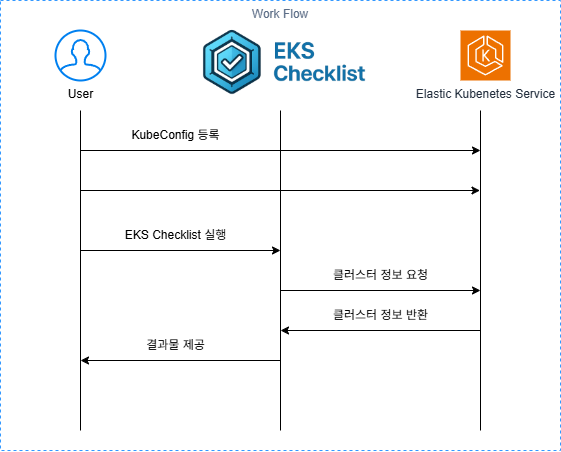

# How It Works

**EKS-Checklist**는 Amazon EKS (Elastic Kubernetes Service) 클러스터를 점검하는 도구입니다. 이 도구는 **Go** 언어로 개발되었으며, AWS SDK for Go, Kubernetes Go Client를 사용하여 클러스터의 상태를 자동으로 점검합니다.



## 주요 기술 스택

- **AWS SDK for Go**: AWS API호출을 하기 위해 사용하며 EKS 클러스터의 설정 및 상태 정보를 가져옵니다
- **Kubernetes Go Client**: Kubernetes API와 직접 상호작용하여 클러스터의 상태를 가져오고 점검합니다.

## 작동 방식

### 1. **AWS SDK for Go를 통한 EKS 클러스터 정보 가져오기**

EKS 클러스터를 점검하려면 우선 **AWS SDK for Go**를 통해 EKS 클러스터에 대한 정보를 가져옵니다. 이를 통해 클러스터의 버전, 상태, 설정 등 기본 정보를 조회할 수 있습니다.

```go
type EksCluster struct {
	Cluster *types.Cluster
}

func Describe(clusterName string, cfg aws.Config) EksCluster {
	eksClient := eks.NewFromConfig(cfg)
	output, err := eksClient.DescribeCluster(context.TODO(), &eks.DescribeClusterInput{
		Name: &clusterName,
	})

	if err != nil {
		panic(err.Error())
	}

	eksCluster := EksCluster{Cluster: output.Cluster}

	return eksCluster
}
```

### 2. **Kubernetes Go Client를 사용한 클러스터 상태 점검**

Kubernetes Go Client를 사용하여 클러스터의 상태를 직접 점검합니다. EKS 클러스터에서 실행 중인 리소스 파드(pod), 노드(node), 서비스(service) 등의 상태를 확인합니다.

```go
config, err := rest.InClusterConfig()
if err != nil {
    log.Fatal("Failed to get in-cluster config: ", err)
}
clientset, err := kubernetes.NewForConfig(config)
if err != nil {
    log.Fatal("Failed to create Kubernetes client: ", err)
}
pods, err := clientset.CoreV1().Pods("").List(context.TODO(), metav1.ListOptions{})
if err != nil {
    log.Fatal("Failed to list pods: ", err)
}
```

### 3. **Cobra를 사용한 CLI 인터페이스 제공**

Cobra 라이브러리는 CLI 명령어를 생성하고, 사용자가 다양한 옵션을 통해 클러스터 점검을 실행할 수 있도록 돕습니다.

```bash
eks-checklist --context my-cluster --profile dev --output text 
```
여기서 --context는 kubeconfig에서 사용할 클러스터 컨텍스트를 지정하고, --profile은 AWS CLI 프로파일을 설정합니다. --output 옵션을 통해 출력 형식을 text나 html로 설정할 수 있습니다

### 4. **결과 출력 및 피드백**

점검 결과는 사용자가 설정한 출력 형식에 맞게 표시됩니다. 예를 들어, text 형식으로 출력하면 터미널에 점검 결과를 표시하고, html 형식으로 출력하면 HTML로 점검 리포트를 생성하여 파일로 저장할 수 있습니다.

```bash
eks-checklist --context my-cluster --profile dev --output html > eks-checklist-report.html
```