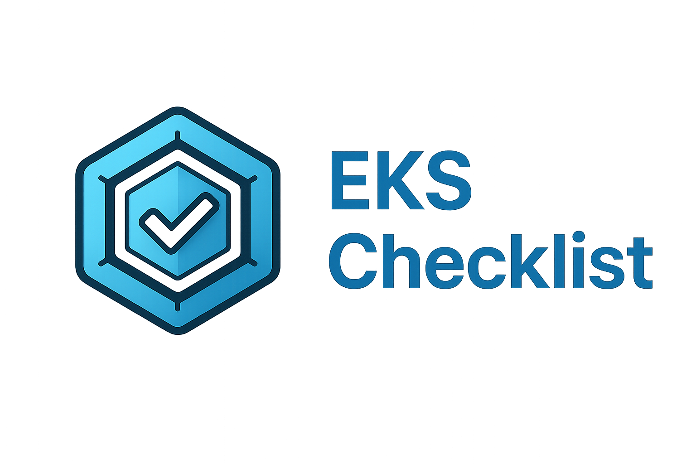
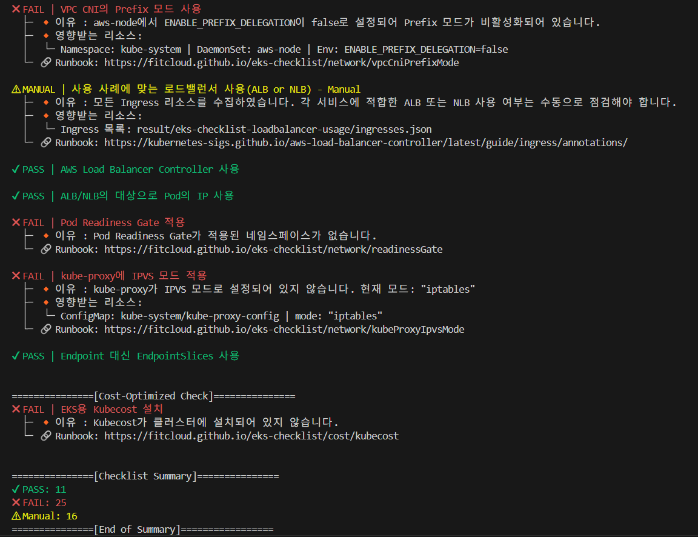

# EKS-Checklist


**EKS-Checklist**는 Amazon EKS (Elastic Kubernetes Service) 클러스터의 설정과 상태를 자동으로 점검하여, 운영자가 클러스터의 구성을 파악하여 **최적화**, **보안**, **비용 절감**, **안정성**을 개선 할 수 있도록 EKS 클러스터 검사 도구입니다.

> 이 도구는 Go 언어로 작성되었으며, AWS SDK for Go, Kubernetes Go Client, 그리고 CLI 명령어 프레임워크인 Cobra를 활용하여 제작되었습니다.

---

## ✅ 프로젝트 목적

**EKS-Checklist**는 EKS Cluster의 문제를 사전에 식별하고 개선할 수 있도록 설계된 도구입니다. AWS 및 Kubernetes의 **모범 사례(Best Practices)**를 기반으로 클러스터 상태를 분석하고, 점검을 통해 식별된 모든 Fail 결과에 대해 의미 있는 Runbook을 제공하여 사용자가 신속하게 문제를 해결하고 보다 안정적이고 효율적인 Cluster 환경을 구축하는 것을 목표로 합니다.

---

## 🔍 점검 항목

| 카테고리        | 설명 |
|----------------|------|
| **비용 최적화 (Cost)**     | 클러스터 리소스 최적화를 통해 과도한/미사용 리소스 확인, 고사양/미사용 인스턴스를 탐지를 통한 절감 방안 식별 |
| **일반 설정 (General)**   | 클러스터 버전, 태그 구성, 메타데이터 등 기본적인 구성이 모범사례에 맞게 구성되어 있는지 확인 |
| **네트워크 (Network)**    | VPC, Subnet, 보안 그룹, ENI, IP 할당 등의 네트워크 구성 요소가 최적화되어 있는지 점검 |
| **확장성 (Scalability)**  | HPA (Horizontal Pod Autoscaler), Cluster Autoscaler, 노드그룹 등 클러스터의 확장성과 자원 관리의 자동화를 위한 설정 점검 |
| **보안 (Security)**       | IAM 정책, 인증 구성, API 서버 접근 제어 등 보안 관련 설정이 적절히 되어 있는지 점검하여 클러스터의 보안 설정 확인 |
| **안정성 (Reliability)**    | 로그, 모니터링, 백업 설정 등의 설정 유무를 점검하여 클러스터의 안정성 진단단 |

---

## 📋 요구 사항

도구를 사용하기 위해 다음 환경이 준비되어 있어야 합니다:

**AWS CLI** 설치: [공식 문서](https://docs.aws.amazon.com/cli/latest/userguide/getting-started-install.html) 참고
   - 인증: `aws configure` 명령어로 설정 (Access Key, Secret, Region 등)
   - 클러스터와 연결된 `kubeconfig`가 설정되어 있어야 함니다

**EKS 클러스터 접근 권한**
   - IAM Role 또는 User가 EKS 클러스터 및 리소스에 접근 가능한 권한이 있어야 합니다.
---

## 📦 설치 방법

### 방법 1: GitHub Releases에서 바이너리 다운로드

1. GitHub의 [Releases 페이지](https://github.com/fitcloud/eks-checklist/releases)로 이동합니다.
2. 운영 체제에 맞는 바이너리 파일을 다운로드합니다:
   - macOS: `eks-checklist-darwin-amd64`
   - Linux: `eks-checklist-linux-amd64`
   - Windows: `eks-checklist-windows-amd64.exe`

---

## 💻 플랫폼별 설치 예시

### Linux

```bash
wget https://github.com/fitcloud/eks-checklist/releases/download/{version}/eks-checklist-linux-amd64
chmod +x eks-checklist-linux-amd64
sudo mv eks-checklist-linux-amd64 /usr/local/bin/eks-checklist
eks-checklist --profile my-aws-profile
```
## MacOS

```bash
curl -LO https://github.com/fitcloud/eks-checklist/releases/download/{version}/eks-checklist-darwin-amd64
chmod +x eks-checklist-darwin-amd64
sudo mv eks-checklist-darwin-amd64 /usr/local/bin/eks-checklist
eks-checklist --profile my-aws-profile
```
## Window

1. .exe 파일을 다운로드하여 예: C:\Program Files\EKS-Checklist\에 저장합니다.
2. 명령 프롬프트 또는 PowerShell에서 다음과 같이 실행합니다:

```bash
cd "C:\Program Files\EKS-Checklist\"
eks-checklist-windows-amd64.exe --profile my-aws-profile
```

## 🚀 사용 방법

### 기본 사용 예시
```bash
eks-checklist --context my-cluster --profile dev --output text
```
### 주요 옵션 설명

| 옵션                | 설명 |
|---------------------|------|
| `--context`         | 사용할 kubeconfig context 이름 |
| `--kubeconfig`      | kubeconfig 파일 경로 (기본: 사용자 홈 디렉토리 경로) |
| `--profile`         | 사용할 AWS CLI 프로파일 이름 |
| `--output`          | 출력 형식 지정 (`text`, `html`) |
| `--filter`             | 결과 필터링 옵션 (`all`, `pass`, `fail`, `manual`) |
| `--sort`            | 결과를 상태별 정렬 (`pass`, `fail`, `manual`) |
| `--help` 또는 `-h` | 도움말 출력 |

## 출력 예시
도구 실행 결과는 다음과 같은 방식으로 정리됩니다:


